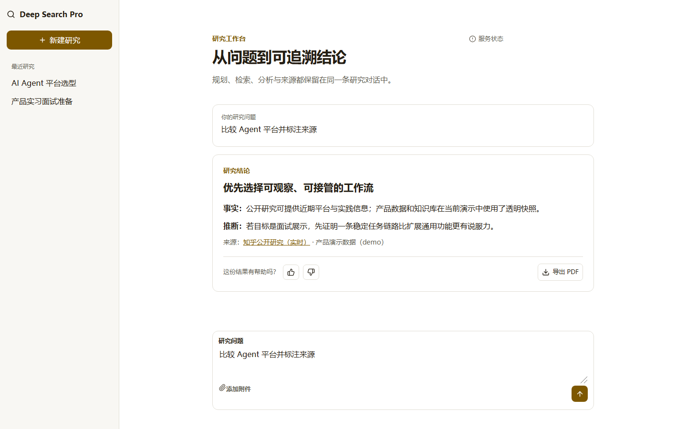

# Deep Search Pro

面向个人复杂任务的多 Agent 深度研究工作台，也是一个面向 Coze AI 产品实习岗位的可演示项目。用户提交问题与资料后，系统生成计划，协调公开研究、产品数据与知识库角色，展示执行状态和数据模式，最后生成可反馈、可导出的研究结果。



## 为什么做这个项目

复杂研究的难点不只是“得到一段回答”，而是确认系统是否理解目标、为什么调用某个工具、来源是否可信，以及外部服务失败后用户还能做什么。项目因此聚焦一条完整链路：

```text
提交任务 → 确认计划 → 多 Agent 执行 → 展示来源/降级 → 研究报告 → 反馈/导出
```

面试版有意不扩展账号、计费和万能工具平台，优先证明任务链路、可解释状态、失败恢复、评测和产品指标设计。

## 架构

- `frontend/`：React + TypeScript 桌面研究工作台，通过 REST 创建/恢复任务，通过 WebSocket 接收过程事件。
- `api/`：FastAPI 协议层、任务生命周期、健康检查、上传下载与版本化事件。
- `agent/`：主协调 Agent、三个研究角色和惰性模型初始化。
- `tools/`：知乎全网搜索、只读 MySQL、RAGFlow、附件读取与文档生成；外部服务不可用时可透明返回 demo 数据。
- `evals/`：30 条评测样本、V1/V2 Prompt 快照、自动评分与报告生成。
- `analytics/`：不记录 Prompt 或文件内容的产品事件契约与离线漏斗分析。

## 当前证据

- 后端：55 个自动化测试通过，包括路径边界、上传限制、只读 SQL、服务降级、任务状态、事件恢复、真实评测执行边界和离线端到端链路。
- 前端：3 个 Vitest 测试、生产构建和 1 条 Playwright 完整浏览器流程通过。
- 真实基础链路：Swagger/OpenAPI、任务创建与快照、WebSocket 中文 `ping/pong` 已在本地服务验证。
- 知乎搜索与 Word COM 转 PDF 曾真实验证成功；MySQL 和 RAGFlow 当前以明确标记的 demo 数据降级。
- 当前模型凭据被服务商返回 401，因此没有伪造 V1/V2 的 30 例线上分数或 3 次真实 Agent 成功率。详见 [评测报告](docs/interview/evaluation-report.md)。

## 本地运行

环境为 Windows、Python 3.13 和 Node.js。所有 Python 命令优先使用仓库内 `.venv`。

```powershell
.\.venv\Scripts\python.exe -m pip install -r requirements-dev.txt
.\.venv\Scripts\python.exe -m uvicorn api.server:app --host 127.0.0.1 --port 8000
```

另开终端启动前端：

```powershell
Set-Location frontend
npm ci
npm run dev
```

模型和外部服务通过环境变量配置。只记录变量名，不要把值写入日志或提交：`LLM_QWEN_MAX`、`OPENAI_API_KEY`、`OPENAI_BASE_URL`、`ZHIHU_ACCESS_SECRET`、MySQL 与 RAGFlow 相关变量。

## 验证

```powershell
.\.venv\Scripts\python.exe -m pytest -q
.\.venv\Scripts\python.exe -m pip check
.\.venv\Scripts\python.exe -m compileall -q agent api tools utils rawflow evals analytics test

Set-Location frontend
npm run test:run
npm run build
npm run e2e
```

## 五分钟演示

1. 提交“比较 AI Agent 平台并说明取舍”的复杂任务，可附加个人资料。
2. 展示并确认执行计划。
3. 观察三个研究角色、实时来源与 demo 降级标记。
4. 打开带来源的研究结论，提交反馈并尝试导出 PDF。
5. 展示服务状态、30 例评测集、失败复盘与下一轮策略假设。

完整讲述见 [演示脚本](docs/interview/demo-script.md)，产品指标见 [指标设计](docs/interview/product-metrics.md)，项目取舍见 [复盘](docs/interview/project-retrospective.md)。

## 安全与限制

- 当前任务状态和 WebSocket 连接为单进程内存实现，不支持多实例持久化和完整事件重放。
- 演示版没有用户认证、会话归属和调用配额，不应直接公开部署。
- 文件接口限制在会话输出目录；上传有标识、文件名、数量、大小和类型校验。
- SQL 工具只允许有限的单条只读查询；外部工具错误会转换为公开错误，不返回密钥、连接串或绝对服务器路径。
- PDF 转换依赖 Windows、Microsoft Word 和 COM。
