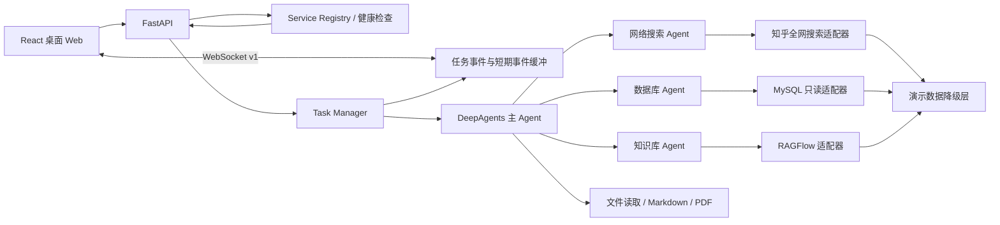

# Coze 面试版多 Agent 深度研究工作台设计

> 状态：已确认设计
>
> 日期：2026-08-08
>
> 目标周期：1-2 周
>
> 目标岗位：Coze AI 产品实习生

## 1. 背景与目标

现有 Deep Search Pro 已具备 FastAPI、WebSocket、DeepAgents/LangGraph、多数据源工具、文件读取和报告生成等后端能力，但业务叙事不统一、没有前端、没有 Agent 效果评测，也无法稳定完成真实端到端任务。

面试版不继续扩展为通用 Agent 平台，而是聚焦一个可在 5 分钟内稳定演示的 C 端复杂任务链路，用实际产品与评测证据证明以下能力：

1. C 端 Agent 核心链路设计与体验优化。
2. 多 Agent 的意图识别、任务规划、工具路由和协作。
3. Agent 回复质量与任务效果的系统评估。
4. Prompt 和工作流策略的版本化迭代。
5. 基于用户反馈、埋点和评测数据作产品判断。
6. 对 AI Native 交互、过程透明度、异常降级和用户信任的理解。

## 2. 产品定义

### 2.1 产品定位

> 面向个人复杂任务的多 Agent 深度研究工作台。用户提交问题和资料后，系统生成执行计划，调度网络搜索、知识库和数据分析 Agent，展示实时过程与来源，最终生成可追问、评价和导出的研究报告。

### 2.2 目标用户

- 需要完成复杂资料搜集与分析的学生和职场用户。
- 对 AI 有一定使用经验，但不愿手动组织多个搜索、文档和数据工具。
- 关心结果可靠性，希望知道 Agent 做了什么、信息来自哪里、哪些数据发生了降级。

### 2.3 核心用户问题

- 复杂任务需要跨网络、文档和结构化数据反复搜索。
- 普通聊天产品只返回答案，用户看不到计划、来源与失败过程。
- 外部服务失败时，用户无法判断答案是否完整或是否使用了虚构信息。
- 输出难以直接转化为可分享、可继续编辑的正式报告。

### 2.4 核心价值

- 将多来源调研组织为一条可理解、可干预的任务链路。
- 将多 Agent 协作从后台日志转化为对用户有意义的执行过程。
- 通过来源引用、live/demo 标识和失败说明提升信任。
- 用 Prompt 版本与离线评测证明 Agent 策略改进，而不是主观宣称效果提升。

## 3. 范围

### 3.1 本期包含

- ChatGPT 式桌面 Web 工作台。
- 会话历史、任务输入和文件上传。
- 意图识别、任务规划与计划确认。
- 网络、数据库、知识库三个 Agent 的执行过程。
- 真实服务优先、演示数据降级。
- 来源、live/demo 状态、耗时和错误展示。
- 结构化结果、追问、反馈和 PDF 导出。
- 服务健康检查与任务状态查询。
- 约 30 条 Agent 评测样本。
- Prompt V1/V2 对比和评测报告。
- 一条可连续演示三次的固定案例。

### 3.2 本期不包含

- 移动端或独立 App。
- 登录、计费、多租户和完整权限系统。
- 完整运营后台。
- 分布式任务队列和生产级多实例部署。
- 视频、编程或其他与核心案例无关的 Agent。
- 多语言和大规模并发。
- 为展示技术而增加没有业务价值的 Agent。

桌面端以 1024px 及以上视口为验收范围，不承诺移动端适配。

## 4. 核心体验

### 4.1 主流程

```text
创建任务
-> AI 识别意图并生成执行计划
-> 用户确认或调整计划
-> 多 Agent 执行检索与分析
-> 用户查看进度、来源与异常
-> 生成带引用的研究报告
-> 用户追问、纠错、评价或导出
```

### 4.2 固定演示脚本

固定演示场景为“AI Agent 平台选型与求职研究”：一名准备 AI 产品实习面试的学生，希望结合公开讨论、自己上传的岗位 JD/学习笔记和结构化产品功能数据，对主流 AI Agent 平台进行比较，并生成产品判断与面试准备报告。

数据源职责固定为：

- 知乎全网搜索：公开观点、产品体验、行业讨论与近期信息。
- 知识库：用户上传的岗位 JD、学习笔记和个人材料。
- 结构化数据：预先整理的产品能力、支持平台、价格区间和功能标签。

演示过程必须包含：

1. 用户输入一个复杂任务并上传一份资料。
2. Agent 给出可编辑的执行计划。
3. 至少两个 Agent 参与执行。
4. 一个数据源使用真实服务，一个数据源进入明确标注的 demo 降级。
5. 用户查看来源和 Agent 执行过程。
6. 系统生成结构化报告。
7. 用户提交反馈并导出 PDF。

演示数据、Prompt、评测集和界面文案统一使用这一场景，不再保留“空调公司”或“药品数据库”的旧叙事。

## 5. 界面设计

### 5.1 设计原则

- 采用 ChatGPT 式桌面工作台结构，借鉴信息架构和交互范式，不复制品牌、商标或视觉资产。
- 界面安静、直接、以任务为中心，不做营销首页。
- 多 Agent 过程以内嵌执行面板呈现，不使用开发日志或复杂后台仪表盘。
- 只有用户需要做决定时才打断任务。
- 所有降级、失败和演示数据必须对用户透明。

### 5.2 页面结构

```text
┌──────────────────┬───────────────────────────────────────────────┐
│ 会话历史          │ 顶部：任务标题、状态、数据源健康状态          │
│                  ├───────────────────────────────────────────────┤
│ 新建任务          │ 对话区：                                      │
│ 最近任务          │ - 用户消息                                    │
│ 已完成            │ - 执行计划                                    │
│ 失败/取消         │ - Agent 执行面板                              │
│                  │ - 来源与阶段结果                              │
│ 设置/健康状态     │ - 最终报告与反馈                              │
│                  ├───────────────────────────────────────────────┤
│                  │ 底部：输入框、附件、停止/发送                  │
└──────────────────┴───────────────────────────────────────────────┘
```

### 5.3 关键界面状态

| 状态 | 用户可见内容 | 可执行操作 |
| --- | --- | --- |
| `draft` | 输入框、附件和示例任务 | 编辑、上传、发送 |
| `planning` | 正在识别意图和生成计划 | 停止 |
| `waiting_confirmation` | 计划步骤、预计数据源 | 修改、确认、取消 |
| `running` | Agent 进度、当前动作、来源 | 暂停、取消、补充材料 |
| `degraded` | 降级来源和影响范围 | 继续、重试真实服务、取消 |
| `needs_input` | 缺少的信息和具体问题 | 补充信息、跳过 |
| `succeeded` | 摘要、报告、引用和任务信息 | 追问、反馈、导出 |
| `failed` | 用户可理解的失败原因 | 重试、修改任务 |
| `cancelled` | 已保留的阶段结果 | 继续、重新开始 |

### 5.4 Agent 执行面板

每个 Agent 显示：

- Agent 名称与职责。
- `queued/running/succeeded/failed/degraded` 状态。
- 当前动作，不显示内部思维链。
- 数据模式：`live` 或 `demo`。
- 已完成步骤和耗时。
- 来源数量与可展开的关键发现。
- 可重试错误和不可重试错误的区别。

## 6. 系统架构

### 6.1 总体架构



### 6.2 技术选择

- 前端：React、TypeScript、Vite。
- 图标：Lucide。
- 后端：保留 FastAPI、DeepAgents、LangGraph/LangChain。
- 实时通信：保留 WebSocket，增加事件序号和短期缓冲。
- 测试：pytest、FastAPI TestClient/httpx，前端使用 Vitest；关键链路可增加 Playwright。
- 演示数据：版本控制内的 JSON/Markdown 固定样本，不包含真实凭据或敏感业务数据。

前端建立为独立目录，后端现有模块边界保持不变。实现阶段根据依赖最小化原则确定是否引入额外 UI 库。

## 7. 服务适配与降级

### 7.1 核心规则

- 模型是硬依赖。模型不可用时阻止任务，不伪造 Agent 推理。
- 网络、MySQL、RAGFlow 是可降级依赖。
- 真实服务优先；不可用时按数据源切换演示数据。
- 降级结果必须携带 `mode=demo` 和明确原因。
- 所有工具返回统一结构，不依赖自然语言判断成功或失败。
- 外部客户端延迟初始化，单项配置异常不得阻止 API 启动。

### 7.2 统一工具结果

```json
{
  "status": "success",
  "source": "zhihu_global_search",
  "mode": "live",
  "duration_ms": 428,
  "items": [],
  "error": null,
  "metadata": {
    "query": "AI Agent 产品经理",
    "result_count": 10
  }
}
```

`status` 仅允许 `success/failed/degraded`，`mode` 仅允许 `live/demo`。

### 7.3 服务健康状态

新增健康状态接口，返回每个服务是否可用及当前模式：

```json
{
  "overall": "degraded",
  "services": {
    "llm": {"status": "unavailable", "mode": "required"},
    "zhihu": {"status": "available", "mode": "live"},
    "mysql": {"status": "unavailable", "mode": "demo"},
    "ragflow": {"status": "unavailable", "mode": "demo"},
    "word": {"status": "available", "mode": "local"}
  }
}
```

健康检查应设置短超时并缓存结果，避免每次渲染页面都产生昂贵的外部请求。

## 8. 知乎全网搜索设计

### 8.1 API

- URL：`https://developer.zhihu.com/api/v1/content/global_search`
- Method：`GET`
- 鉴权：`Authorization: Bearer <secret>`
- 时间戳：`X-Request-Timestamp`，使用当前秒级 Unix 时间戳。
- 环境变量：`ZHIHU_ACCESS_SECRET`。
- 默认参数：`Count=10`、`SearchDB=all`。
- `Count` 在代码层限制为 1-20。

密钥只能从环境变量读取，不得硬编码、提交、打印或进入 WebSocket 事件。

### 8.2 请求与响应流程

```text
Agent 搜索请求
-> 参数校验和 URL 编码
-> 知乎全网搜索 API
-> 检查 HTTP 状态和 API Code
-> 清洗 ContentText 中的 HTML 高亮
-> 容错缺失字段
-> 规范化结果
-> 交给 Agent 使用
```

规范化字段：

- `title`
- `url`
- `snippet`
- `content_type`
- `author_name`
- `author_badge_text`
- `authority_level`
- `vote_up_count`
- `comment_count`
- `edit_time`
- `source=zhihu_global_search`
- `mode=live/demo`

真实测试已确认 HTTP 200、API Code 0 并返回内容。测试同时发现 `ContentType` 可能为空，尽管接口文档将其标为必返，因此所有字段必须提供安全默认值。

### 8.3 质量与可信度

结果排序综合查询相关性、`AuthorityLevel`、内容时效性、作者认证和互动数据。互动数据和知乎权威等级不能直接视为事实真实性。

事实型结论应尽量交叉验证；观点型内容在最终结果中明确标为观点。报告不得将知乎用户内容包装为官方结论。

### 8.4 降级

以下情况切换演示搜索快照：

- 网络超时或连接失败。
- HTTP 401/403、429 或 5xx。
- API Code 非 0。
- 响应无法解析或关键数据结构错误。

鉴权失败必须同时在健康状态中显示，不应无限重试。429 和部分 5xx 可进行有限次数、带退避的重试。

## 9. MySQL 与 RAGFlow

### 9.1 MySQL

- 真实分支使用只读数据库账户。
- 代码层仅允许单条只读查询，拒绝写入、DDL、存储过程和多语句。
- 表名必须来自已发现的允许列表，不直接拼接未经校验的模型输入。
- 设置查询超时、最大返回行数和输出大小。
- 连接或认证失败时使用固定结构化演示数据。

### 9.2 RAGFlow

- 客户端延迟初始化。
- 列表和提问均设置超时与结构化错误。
- 临时会话必须在 `finally` 中清理。
- 服务不可用时使用本地 Markdown 知识样本。
- 演示知识样本的来源必须标为 demo，不宣称来自真实企业知识库。

## 10. 任务与事件协议

### 10.1 任务状态

```text
draft
planning
waiting_confirmation
running
degraded
needs_input
succeeded
failed
cancelled
```

MVP 可使用单进程内存任务管理器，但必须保存任务引用、当前状态、终态结果和有限事件缓冲。服务重启后不承诺恢复任务，并在文档中明确该限制。

### 10.2 API

保留现有 API，并新增或调整：

- `GET /api/health`：服务健康和数据模式。
- `POST /api/task`：创建任务；模型不可用时返回结构化错误。
- `GET /api/tasks/{thread_id}`：获取当前状态、结果和最近事件。
- `POST /api/tasks/{thread_id}/confirm`：确认或修改执行计划。
- `POST /api/tasks/{thread_id}/cancel`：取消任务。
- `POST /api/tasks/{thread_id}/feedback`：提交任务反馈。
- `WS /ws/{thread_id}`：实时事件。

### 10.3 WebSocket 事件

```json
{
  "version": "1",
  "sequence": 12,
  "type": "agent_status",
  "thread_id": "...",
  "timestamp": "2026-08-08T12:00:00+08:00",
  "data": {}
}
```

核心事件：

- `task_status`
- `plan_ready`
- `agent_status`
- `source_added`
- `degradation`
- `result_delta`
- `task_result`
- `error`

前端重连后通过任务状态接口和最后的 `sequence` 恢复，不依赖 WebSocket 完整保存历史。

## 11. 错误处理

统一错误结构：

```json
{
  "code": "LLM_AUTH_FAILED",
  "message": "模型服务认证失败",
  "user_action": "请检查模型配置",
  "retryable": false,
  "source": "llm"
}
```

处理规则：

- 模型不可用：阻止任务并明确提示配置问题。
- 知乎搜索不可用：按规则重试后切换搜索快照。
- MySQL 不可用：切换本地结构化数据。
- RAGFlow 不可用：切换本地知识样本。
- 单个 Agent 失败：其他 Agent 继续，最终结果标记缺失范围。
- 所有数据源失败：停止生成事实结论。
- WebSocket 中断：自动重连并读取任务状态。
- 文档导出失败：保留文本结果并允许单独重试。
- 用户取消：取消后台任务并保留已完成的阶段结果。

用户界面展示简明错误；原始异常进入本地开发日志，但必须脱敏。

## 12. Agent 策略与评测

### 12.1 Prompt V2 原则

- 先识别意图、交付物和约束，再生成计划。
- 根据数据边界选择 Agent，不为展示多 Agent 调用无关工具。
- 工具返回必须包含来源和数据模式。
- 结论必须能映射到来源。
- 区分事实、观点和推断。
- 信息冲突时展示冲突，不强行合并。
- 工具失败时按结构化状态执行降级。
- 不暴露内部思维链，只输出用户需要的计划和过程摘要。

当前 Prompt 作为 V1 基线，V2 单独版本化。评测必须使用相同任务集运行两个版本。

### 12.2 评测集

建立约 30 条任务：

- 6 条网络搜索任务。
- 6 条知识库任务。
- 6 条数据库任务。
- 8 条多 Agent 协作任务。
- 4 条模糊意图、异常或越界任务。

每条样本记录输入、预期 Agent、预期交付物、必需事实和禁止行为。

### 12.3 评测指标

| 维度 | 指标 | 目标 |
| --- | --- | --- |
| 意图识别 | 意图准确率 | >= 90% |
| Agent 路由 | 路由准确率 | >= 85% |
| 任务规划 | 人工计划质量评分 | 平均 >= 4/5 |
| 任务效果 | 任务完成率 | >= 90% |
| 引用质量 | 引用支持率 | >= 85% |
| 工具效率 | 平均无效工具调用 | V2 比 V1 降低 >= 30% |
| 降级透明 | 降级标注准确率 | 100% |
| 性能 | 平均任务耗时 | V2 不比 V1 恶化超过 20% |

目标值用于验收，不预先填写结果。最终报告只展示真实运行得到的数据。

## 13. 产品数据指标

北极星指标：

> 有效复杂任务完成率：用户成功获得结果，且没有负反馈或立即重新执行的任务比例。

关键埋点：

- `task_draft_created`
- `task_submitted`
- `plan_generated`
- `plan_edited`
- `plan_confirmed`
- `agent_started`
- `agent_completed`
- `source_opened`
- `degradation_triggered`
- `task_completed`
- `task_failed`
- `followup_submitted`
- `report_exported`
- `feedback_submitted`
- `task_retried`

辅助指标包括提交率、计划修改率、任务完成率、首次有效反馈时间、Agent 失败率、降级率、来源点击率、追问率、导出率、反馈率和失败后重试成功率。

本期不实现复杂分析后台；事件输出到结构化日志或本地数据文件，并生成一页离线分析报告。

## 14. 安全设计

- `thread_id` 使用服务端 UUID 或严格格式校验。
- 上传文件名只保留安全 basename，拒绝绝对路径和父目录片段。
- 所有文件工具使用 `resolve()` 和 `is_relative_to()` 强制限制在会话目录。
- 数据库只读并限制 SQL、行数、耗时和返回体积。
- API 错误和 WebSocket 事件不包含密钥、密码和完整连接串。
- `/api/files` 和下载接口使用文件 ID 或会话内相对路径，不返回服务器绝对路径。
- 上传限制文件数量、单文件大小、总大小和允许类型。
- CORS 使用本地前端明确白名单。
- 演示数据不包含真实用户或企业敏感信息。

本期不实现完整登录授权，但接口只用于本机演示，不对公网开放。

## 15. 测试设计

### 15.1 单元测试

- 路径不能越过会话目录。
- 上传文件名和 `thread_id` 校验。
- SQL 只读限制。
- 服务健康状态判断。
- live/demo 降级切换。
- 统一工具结果 schema。
- 知乎参数、时间戳、HTML 清洗和缺失字段容错。
- 模型不可用时任务不会假装成功。
- Windows 默认编码下 Markdown 可生成。
- PDF 导出失败不影响文本结果。

### 15.2 集成测试

- 真实模型 + 真实知乎 + 演示数据库 + 演示知识库。
- 真实模型 + 知乎失败降级。
- 真实模型 + MySQL 真实只读查询。
- 模型认证失败。
- WebSocket 心跳、事件顺序、中断和重连。
- 上传、任务执行、文件列表、下载与反馈。

外部服务测试默认不进入纯离线单元测试，使用显式标记运行，避免无意消耗额度。

### 15.3 演示验收

- 固定案例连续运行三次成功。
- 每次均能展示计划、多 Agent 过程、至少一个真实来源、一次透明降级、最终报告和 PDF 导出。
- 演示全程不暴露密钥、绝对路径或内部错误堆栈。
- 单次演示在 5 分钟内完成。

## 16. 当前验证事实与外部前提

在全新 `.venv`、Python 3.13.5 中已验证：

- `requirements.txt` 安装成功，`pip check` 无冲突。
- Python 语法编译和核心模块导入成功。
- FastAPI 服务、Swagger、OpenAPI、WebSocket 心跳和文件上传成功。
- 知乎全网搜索真实请求返回 HTTP 200、API Code 0 和有效内容。
- Markdown/PDF 在 UTF-8 测试进程中生成成功，Word COM 可用。
- 完整任务可创建并推送 `session_created` 与 `error` 事件。

当前阻塞与降级状态：

- DashScope 当前密钥返回 401，是实施联调的硬阻塞；需要有效密钥。
- MySQL 返回 1045，可先使用 demo 降级。
- RAGFlow 地址返回 502，可先使用 demo 降级。
- Windows 默认 GBK stdout 会被 Markdown 工具中的 Unicode 符号触发异常，需要代码修复。
- `pytest` 未列入现有依赖，测试文件为空，需要建立测试基线。

所有新密钥由用户写入本机 `.env`，不得出现在设计文档、代码或提交历史中。

## 17. 交付节奏

### 阶段 1：可运行基线，3-4 天

- 修复 Windows 编码与核心安全边界。
- 增加服务健康检查和统一结果/错误结构。
- 实现知乎搜索适配器。
- 实现 MySQL、RAGFlow 和网络搜索降级。
- 建立 pytest 基线。
- 跑通固定多 Agent 案例。

### 阶段 2：桌面体验，3-4 天

- 建立 ChatGPT 式 React 桌面界面。
- 实现会话、输入、上传、计划确认和 Agent 执行面板。
- 实现来源、live/demo 标识、错误恢复、反馈与导出。

### 阶段 3：评测与面试材料，2-3 天

- 建立约 30 条评测集。
- 运行 Prompt V1/V2 对比。
- 生成评测与产品指标报告。
- 完成关键界面高保真稿。
- 准备 5 分钟演示脚本和项目复盘。

## 18. 成功标准

本设计完成的判定标准：

1. 有效模型配置下，固定案例可连续三次完成。
2. 知乎真实搜索可用，其他数据源失败时能透明降级。
3. 用户可以完成输入、计划确认、执行观察、结果查看、反馈和导出闭环。
4. 关键结论可以查看来源和数据模式。
5. 路径、上传和数据库只读边界有自动化测试。
6. 约 30 条评测任务完成 V1/V2 对比。
7. 所有展示指标来自真实测试，不使用虚构提升数字。
8. 面试演示可在 5 分钟内完成，并能解释产品取舍、失败案例和下一步规划。
